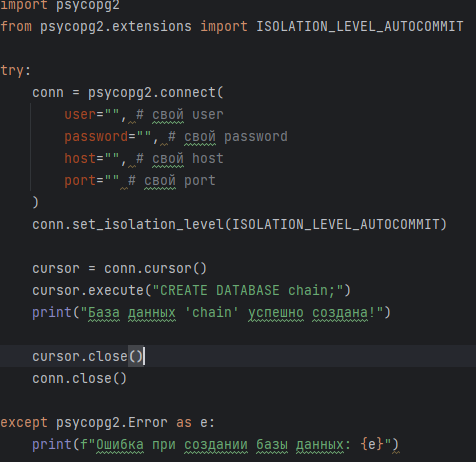

# Онлайн платформа-торговой сети электроники

## Содержание
- [Технологии](#Технологии)
- [Функциональность](#Функциональность)
- [Быстрый старт](#Быстрый старт)
- [API Endpoints](#API Endpoints)
- [Админ-панель](#Админ-панель)

## Технологии
- Backend: Django 4.2.8, Django REST Framework 3.16.1
- База данных: PostgreSQL
- Аутентификация: Session Authentication, Basic Authentication
- Фильтрация: Django Filter
- Документация: Django REST Framework Web API
## Функциональность
### Управление сетью
- Иерархическая структура из 3 уровней: Завод → Розничная сеть → ИП
- Автоматическое определение уровня на основе отношений
- Полная контактная информация для каждого звена
- Управление продуктами для каждого узла сети

### Безопасность и доступ
- Доступ к API только для активных сотрудников
- Session и Basic аутентификация
- Админ-панель с расширенным функционалом

### Админ-панель
- Просмотр и редактирование всех объектов
- Ссылки на поставщиков между объектами
- Фильтрация по городам
- Mass action для очистки задолженности

### REST API
- Полный CRUD для узлов сети и продуктов
- Фильтрация по стране, городу, уровню
- Запрет на обновление поля задолженности через API

## Быстрый старт
### Требования
- Python 3.8+
- PostgreSQL 10+
- pip

## Установка
- Клонируйте репозиторий
- Установите зависимости
- Создайте БД c помощью скрипта create_db.py



```bash
https://github.com/KirsanV/certification_w
